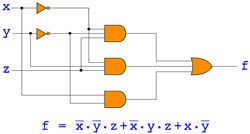

# Minimisation of boolean functions

## A vintage PL/I implementation from 1986 brought back to life!

> [!NOTE]
> This is not a solution for modern applications.
It is just presented for historic interest and to demonstrate the algebraic method of prime implicant production.

### Background

This was my final-year BSc project at Bristol Polytechnic, now [UWE Bristol](https://www.uwe.ac.uk/) (University of the West of England).
My course was Electrical Engineering
but they let me do a 100% software project because it related to electronics – minimising logic circuitry.

### Concept

This is a version of the [Quine–McCluskey](https://en.wikipedia.org/wiki/Quine%E2%80%93McCluskey_algorithm) algorithm
that also incorporates algebraic methods proposed by Nagle *et al.* for improved efficiency
(ref. *An Introduction to Computer Logic; H.T.Nagle, B.D.Carroll & J.D.Irwin; Prentice-Hall, 1975*).

### Implementation

The program was coded in [PL/I](https://en.wikipedia.org/wiki/PL/I) Subset G (General Purpose), initially developed by IBM.
It ran on a 1979 PRIME 550 System [minicomputer](https://en.wikipedia.org/wiki/Minicomputer)
by [Prime Computer, Inc.](https://en.wikipedia.org/wiki/Prime_Computer)
running the [PRIMOS](https://en.wikipedia.org/wiki/PRIMOS) operating system
and accessed from dumb terminals.
The photo shows a similar system at [Chilten Atlas Computer Laboratory](https://www.chilton-computing.org.uk/acd/icf/mums/p014.htm).

I chose PL/I because it can perform bitwise logical operations on arbitrary length bit strings which even today is quite rare –
few modern languages natively support packed bit arrays with bitwise and shift operators.
And in its time PL/I was the language of choice for scientific, engineering and system programming –
I hoped the novel approach would impress the examiners!

The 1986 [source code](1986/1986-bool_min.pli)
derives from the original line printer [listing](https://scriptit.uk/download/1986-list-lineprint.pdf)
via scanning, optical character recognition and extensive correction
(OCR does not handle old dot-matrix print well).
The [test runs](https://scriptit.uk/download/1986-runs-lineprint.pdf) were also scanned
from 14.5" x 11" yellowing fan-fold printouts.

Recently (2024) I managed to get the program running again using the excellent
[Iron Spring PL/I compiler](http://www.iron-spring.com/) introduced in 2007,
on Ubuntu Linux under [VirtualBox](https://www.virtualbox.org/) on a Mac Pro.
I also tried the [Digital Research PL/I Compiler](https://winworldpc.com/product/digital-research-pl-i-compiler/)
under [DOSBox](https://www.dosbox.com/) but it lacked some builtins and failed to parse certain bit expressions.

After fixing minor [compatibility issues](https://htmlpreview.github.io/?https://github.com/scriptituk/bool_min/blob/main/src/bool_min-diff.html) it works like a charm. It is programmed to handle a function order of 96 but only tested for 8 (see [test-9](test/test-9.txt)) which took 8½ minutes on the PRIME but just a second or two on the Mac.

The amended source code is [bool_min.pli](src/bool_min.pli),
and the [src/](src/) directory also contains everything needed to build it on Linux.
The [test/](test/) directory replicates the original [test runs](https://scriptit.uk/download/1986-runs-lineprint.pdf).
I shall scan and upload the accompanying dissertation sometime but it is quite brief – mastering PL/I and coding the program occupied most of my time.
